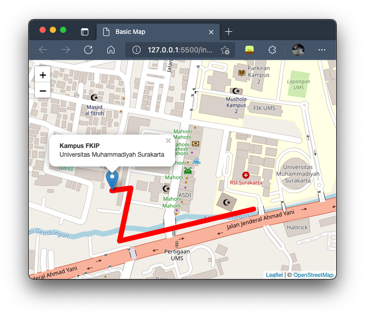

# 3. Mengenal Vector Layer

Vector layer merupakan kumpulan suatu point, garis atau poligon yang dapat kita gunakan untuk menambahkan unsur interaktif ke dalam map. Secara sepintas kita sudah belajar mengenai marker dan popup di Bab 2. Pada bab ini kita akan belajar fitur lain dari vector layer.

Untuk mempermudah belajar bab ini, silakan unduh file index-starter.html dari link berikut [https://github.com/arifsetwn/belajar-leafletjs/tree/master/kode/3](https://github.com/arifsetwn/belajar-leafletjs/tree/master/kode/3) . Rename menjadi `index.html.` File tersebut menjadi dasar tutorial di Bab 3 ini

## 3.1 Marker

#### 3.1.1 Custom Marker Image

Sebuah marker sebenarnya adalah gambar png yang dapat kita ubah dengan gambar yang lain.  Misalkan kita ingin mengganti marker default menjadi seperti berikut&#x20;

 (1).png>)

Unduh `custom_marker.png` marker dari : [https://github.com/arifsetwn/belajar-leafletjs/tree/master/kode/3](https://github.com/arifsetwn/belajar-leafletjs/tree/master/kode/3)

Simpan dan jadikan dalam satu folder dengan file `index.html` yang sudah diunduh sebelumnya.

Tulis kode berikut sebelum kode pembuatan marker, kode ini digunakan untuk menginisiasi file logo marker tadi

```
 let myIcon = L.icon({
        iconUrl: "custom_marker.png",
        iconSize: [40,45]
      });
```

Ubah kode `marker_fkip` menjadi seperti berikut

```
 let marker_fkip = L.marker([-7.5584646, 110.7679351], {icon:myIcon}).addTo(map);
```

Buka `index.html` maka logo marker akan berubah

.png>)

#### 3.1.2 Circle Marker

Fitur marker lain yang dapat kita gunakan adalah circle marker. Berbeda dengan custom marker, circle marker tidak menggunakan file gambar. Namun lingkaran marker langsung digambar pada map. Kita dapat mengatur radius lingkaran, warna garis lingkaran dan warna isi lingkaran.

Gunakan file `index-starter.html` kemudian tulis kode ini dibawah kode `marker_fkip`

```
      let marker_siwal = L.circleMarker(
        [-7.5581427,110.7714950], 
        {radius: 50, color: "black", fillColor: "red"}
      ).addTo(map);
      
```

Kode diatas akan membuat circle marker di sekitar gedung induk Siti Walidah

 (1).png>)

## 3.2 Line

Untuk membuat garis pada map kita dapat menggunakan fungsi `L.polyline` dengan menentukan titik-titik koordinat garis yang akan dilewati. Dengan menggunakan `index-starter.html` tulislah kode berikut ini setelah kode `marker_fkip`

```
      let line = L.polyline(
        [
          [-7.5584646, 110.7679351],
          [-7.558406, 110.7683359],
          [-7.559507, 110.7680997],
          [-7.558842, 110.7708997],
        ],
        { color: "red", weight: 10 }
      ).addTo(map);
      
```

Baris ke 3-6 merupakan titik koordinat yang akan dilewati garis. Sedangkan baris ke-8 merupakan atribut dari garis yang akan memiliki warna merah dan ketebalan 10. Jika dijalankan maka akan menampilkan hasil berikut ini&#x20;



## 3.3 Polygons

Pembuatan polygons hampir mirip dengan pembuatan garis, fungsi yang digunakan adalah `L.polygon` dengan memberikan titik-titik koordinat untuk membuat sebuah polygons. Dengan titik-titik koordinat tersebut kita dapat membuat lingkaran, kotak hingga bentuk yang komplek. Dengan menggunakan `index-starter.html` tulislah kode berikut ini setelah kode `marker_fkip`

```
  let kampus1 = L.polygon(
    [
      [-7.557218, 110.766729],
      [-7.557415, 110.768024],
      [-7.556862, 110.768293],
      [-7.557042, 110.769323],
      [-7.558999, 110.768937],
      [-7.558606, 110.767477],
      [-7.558064, 110.766597],
    ],
    { color: "red", fillColor: "yellow", weight: 4 }
  ).addTo(map);
```

Hasil dari kode diatas adalah seperti berikut

.png>)


## 3.4 Popup

Kita sudah belajar membuat Popup pada Bab 2. Pembuatan popup dilakukan dengan menggunakan fungsi `bindPopup`. Kode berikut ini contoh pembuatan popup pada maker fkip

```
      let marker_fkip = L.marker([-7.5584646, 110.7679351]).addTo(map);

      marker_fkip
        .bindPopup("<b>Kampus FKIP</b><br>Universitas Muhammadiyah Surakarta");
```

Jika ingin popup otomatis terbuka kita dapat menambahkan `openPopup()` di baris ke 4. Sehingga kodenya menjadi

```
      marker_fkip
        .bindPopup("<b>Kampus FKIP</b><br>Universitas Muhammadiyah Surakarta")
        .openPopup();
```


## 3.5 Layer Grup & Layer Control

Layer Grup berfungsi untuk menggabungkan beberapa layer menjadi satu. Layer tersebut bisa berupa marker, polygons atau garis. Sedangkan layer control berfungsi untuk membantu user berpindah layer pada map

#### 3.5.1 Layer Grup

Sebagai contoh kita akan membuat 3 buah titik yang terbagi menjadi 2 layer.

1. layer dekanat = terdiri dari 1 titik yaitu marker di dekanat fkip \[-7.5584646, 110.7679351]
2. layer kuliah = terdiri dari 2 titik yaitu gedung i \[-7.557285, 110.768377] dan auditorium \[-7.558407, 110.768837]

maka penulisan 3 buah titik tersebut sebagai berikut

```
      let marker_fkip = L.marker([-7.5584646, 110.7679351]).bindPopup(
        "<b>Kampus FKIP</b><br>Universitas Muhammadiyah Surakarta"
      );
      let auditorium = L.marker([-7.558407, 110.768837]).bindPopup(
        "<b>Auditorium</b>"
      );
      let gedung_kuliah = L.marker([-7.557285, 110.768377]).bindPopup(
        "<b>Gedung Kuliah</b>"
      );
```

kemudian dengan bantuan layer group, tulis kode berikut ini untuk membuat dua buah layer

```
      let dekanat = L.layerGroup([marker_fkip]);
      let kuliah = L.layerGroup([auditorium, gedung_kuliah]);
```

kita masukkan 2 layer tersebut kedalam map, (perhatikan baris ke 4)

```
      let map = L.map("map", {
        center: [-7.5580281, 110.7694159],
        zoom: 17,
        layers: [dekanat, kuliah],
      });
```

#### 3.5.2 Layer Control

Untuk membuat layer control kita perlu membuat object yang berisi layer marker tadi.

```
      let overlayMaps = {
        "Dekanat": dekanat,
        "Gedung Kuliah": kuliah,
      };
```

Kemudian menggunakan L.control.layers untuk membuat button pada peta.

```
      L.control.layers(overlayMaps).addTo(map);
```

Klik Run Pen untuk melihat hasil jadinya. Pada sisi kanan atas kita sekarang memiliki button untuk memilih marker mana yang akan dimunculkan.&#x20;

Untuk melihat source code pilih button HTML


